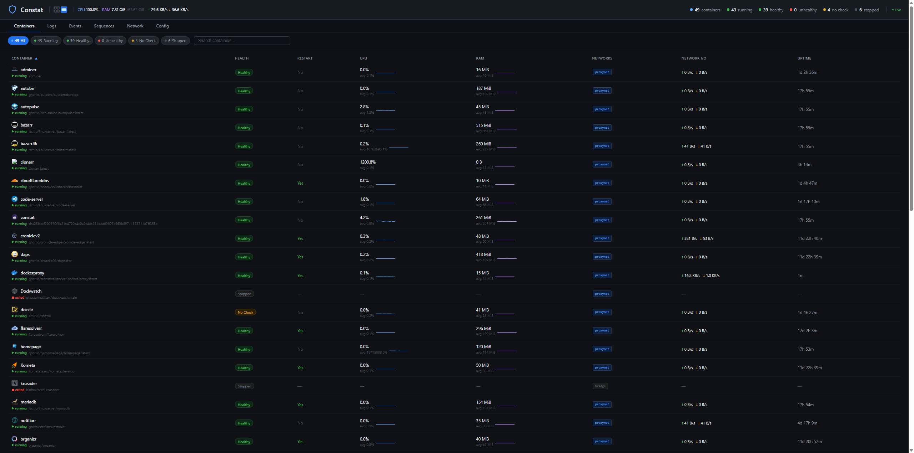
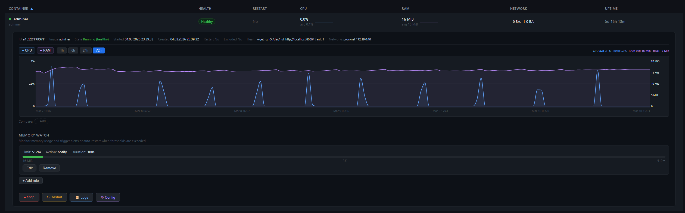
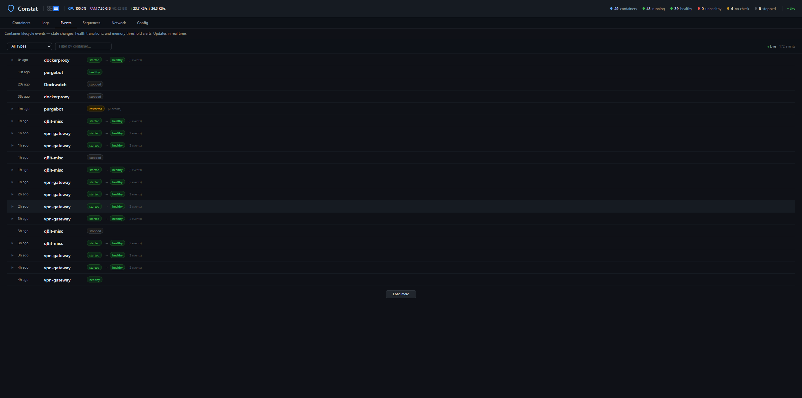

# Constat

A Docker container monitor with a built-in web UI. Track container health, view live resource stats, stream logs, get Discord notifications, and auto-restart unhealthy containers — all from a single lightweight image.

## Screenshots

| Containers | Expanded View |
|-----------|---------------|
|  |  |

| Events | Sequences |
|--------|-----------|
|  |  |

## Features

- **Live stats** — CPU, RAM, and network usage updated every 3 seconds via streaming
- **Health monitoring** — tracks Docker healthcheck status, detects unhealthy containers
- **Auto-restart** — label-gated restart for unhealthy containers with cooldown protection
- **Memory watch** — per-container memory thresholds with notify or restart actions
- **Log viewer** — real-time log streaming with level detection and color-coded display
- **Event history** — Docker events (start, stop, die, health changes) with grouping
- **Sequences** — multi-step container orchestration (start/stop chains with dependencies)
- **Charts** — CPU/RAM history graphs with 1h/6h/24h/72h range selection
- **Healthcheck suggestions** — built-in database of recommended healthchecks for common images
- **Config inspector** — view ports, volumes, networks, env vars, and labels per container
- **Discord notifications** — state changes and health events with colored embeds
- **Docker-native** — PUID/PGID/UMASK, healthcheck, Alpine-based (~46 MB)

## Quick Start

### 1. Run with Docker

```bash
docker run -d \
  --name constat \
  --restart unless-stopped \
  -p 7890:7890 \
  -v /var/run/docker.sock:/var/run/docker.sock:rw \
  -v /path/to/config:/config \
  -e TZ=America/New_York \
  constat:latest
```

On first start, a default `constat.conf` is created in the config directory. Open the Web UI at `http://your-host:7890`.

**Requirements:** Docker socket access (read/write) for container monitoring, stats, and restart. If you prefer not to mount the socket directly, see [Docker Socket Proxy](#docker-socket-proxy) below.

### 2. Initial Setup

1. Open `http://your-host:7890` — the Web UI is available immediately
2. Your containers appear automatically with live stats (CPU, RAM, network)
3. Click any container row to expand details, charts, and quick actions
4. To enable auto-restart, add the Docker label `constat.restart=true` to containers you want restarted when unhealthy (see [Auto-Restart](#auto-restart))
5. To set up Discord notifications, go to the **Config** tab and add your webhook URLs (see [Discord Webhooks](#discord-webhooks))
6. To add memory monitoring, create rules in the **Config** tab under Memory Watch (see [Memory Monitoring](#memory-monitoring))

## Web UI

The built-in Web UI runs on port 7890 (same container, no separate service).

### Containers Tab

The main view — a sortable table of all containers with live-updating stats:

- **Filter pills** — All, Running, Healthy, Unhealthy, No Check, Stopped
- **Search** — filter by container name
- **Sortable columns** — Name, Health, Restart, CPU, RAM, Network, Uptime
- **Sparklines** — mini CPU/RAM/Network graphs in each row (click to open full chart)
- **Restart toggle** — clickable Yes/No to override auto-restart per container

**Expanded view** (click a container row):
- Container details: image, state, started/created dates, healthcheck command
- Config inspector: ports, volumes, networks, environment variables, labels
- CPU/RAM charts with selectable range (1h, 6h, 24h, 72h) and multi-container comparison
- Memory watch rules with live progress bars
- Healthcheck suggestions for containers without a healthcheck
- Quick actions: Start, Stop, Restart

### Logs Tab

Real-time log streaming for any container:

- Sidebar with container list for quick switching
- Server-side timestamp extraction and ANSI escape stripping
- Color-coded level detection (error, warn, info, debug)
- Dozzle-inspired styling with colored left borders per level
- Tail line count selector (100, 500, 1000)

### Events Tab

Docker event history with intelligent grouping:

- State events: started, stopped, died, restarted, paused
- Health events: unhealthy, healthy, recovered
- Memory events: threshold notify, restart, blocked, recovered
- Auto-restart indicators and grouped rapid events
- Newest-first ordering with load-more pagination

### Sequences Tab

Multi-step container orchestration:

- Create named sequences with emoji icons
- Add steps: start, stop, or restart specific containers
- Per-step options: required/optional, wait for healthy, custom delay
- Live execution tracking with step-by-step progress
- Dependency chains — fail-fast on required steps, skip optional failures
- Searchable container dropdown for step assignment

### Config Tab

Edit all settings from the browser:

- Discord webhooks (state + health, separate channels)
- Memory watch rules — add, edit, remove with inline forms
- Display toggles: show/hide stats columns, charts
- Embed color customization with hex previews
- Time/date format and timezone
- Webhook test button

## Configuration

All settings live in `/config/constat.conf` (bash format). A sample config is created on first start with all options documented. You can edit the file directly or use the Config tab in the Web UI.

### Discord Webhooks

Send notifications to Discord when containers change state or become unhealthy.

1. In Discord, right-click a channel > **Edit Channel** > **Integrations** > **Webhooks** > **New Webhook**
2. Copy the webhook URL
3. Add it in the Config tab or directly in `constat.conf`:

```bash
ENABLE_DISCORD="true"
DISCORD_WEBHOOK_STATE="https://discord.com/api/webhooks/..."   # start/stop/die/restart
DISCORD_WEBHOOK_HEALTH="https://discord.com/api/webhooks/..."  # unhealthy/recovered
```

You can use the same webhook URL for both, or separate channels for different notification types. Use the **Test Webhook** button in the Config tab to verify.

### Auto-Restart

Constat only restarts containers that have the Docker label `constat.restart=true`. This prevents accidental restarts of containers you want to manage manually.

**Adding the label:**
- **Docker run:** `--label=constat.restart=true`
- **Docker Compose:** under `labels:` add `constat.restart: "true"`
- **Unraid:** add `--label=constat.restart=true` in Extra Parameters

Containers without the label are still monitored — health events go to Discord, but no restart is attempted.

```bash
RESTART_LABEL="constat.restart"
RESTART_COOLDOWN="300"    # Min seconds between restarts
MAX_RESTARTS="3"          # Max attempts per cooldown window
```

The restart override toggle in the UI lets you temporarily disable auto-restart per container without removing the label.

### Memory Monitoring

Watch memory usage per container — no Docker `--memory` flags needed. When a container stays above the threshold for the specified duration, Constat can notify you or restart it.

```bash
MEMORY_PAUSED="false"
MEMORY_POLL_INTERVAL="30"
MEMORY_DEFAULT_DURATION="300"   # Seconds above threshold before action

MEMORY_WATCH=(
    "plex:4g:restart"             # Restart if >4 GiB for 5 min
    "radarr:2g:notify"            # Notify if >2 GiB for 5 min
    "qBit-movies:3g:restart:600"  # Restart if >3 GiB for 10 min
)
```

Rules can also be managed from the Config tab in the Web UI.

### Healthcheck Suggestions

Constat includes a built-in database of recommended healthcheck commands for common Docker images (Plex, Radarr, Sonarr, Prowlarr, Bazarr, PostgreSQL, MariaDB, qBittorrent, SWAG, and more). When a running container has no healthcheck configured, a suggestion appears in the expanded view with the command to add as an Extra Parameter.

### Docker Socket Proxy

If you prefer not to mount the Docker socket directly, Constat supports connecting via a TCP proxy:

```bash
-e DOCKER_HOST=tcp://dockerproxy:2375
```

Note: you'll need read/write access for container restart and start/stop functionality. Read-only proxies will limit Constat to monitoring only.

## Docker

### Environment Variables

| Variable | Required | Default | Description |
|----------|----------|---------|-------------|
| `TZ` | No | `UTC` | Container timezone |
| `PUID` | No | `99` | User ID for file ownership |
| `PGID` | No | `100` | Group ID for file ownership |
| `UMASK` | No | `002` | File creation mask |
| `DOCKER_HOST` | No | — | Docker socket proxy URL (optional) |
| `UI_ENABLED` | No | `true` | Set to `false` to disable the web UI |

### Volumes

| Container Path | Purpose |
|---------------|---------|
| `/var/run/docker.sock` | Docker socket (required for monitoring) |
| `/config` | Config, sequences, stats history, restart overrides |

### Ports

| Port | Purpose |
|------|---------|
| `7890` | Web UI |

### Docker Compose

```yaml
services:
  constat:
    image: constat:latest
    container_name: constat
    restart: unless-stopped
    ports:
      - "7890:7890"
    volumes:
      - /var/run/docker.sock:/var/run/docker.sock:rw
      - ./constat-config:/config
    environment:
      - TZ=America/New_York
      - PUID=99
      - PGID=100
```

### Building from Source

```bash
git clone https://github.com/prophetse7en/constat.git
cd constat
docker build -t constat:latest .
```

### Healthcheck

Built-in healthcheck calls `/api/summary` every 60 seconds. Docker (and platforms like Unraid/Portainer) will show the container as healthy when the API responds.

### Unraid

Constat includes an Unraid Docker template for easy installation.

**Add the template repository (one-time):**

1. In the Unraid web UI, go to **Docker** tab
2. Scroll to the bottom and click **Template Repositories**
3. Add this URL: `https://github.com/prophetse7en/constat`
4. Click **Save**

**Install the container:**

1. Click **Add Container**
2. From the **Template** dropdown, select **constat**
3. Adjust the timezone if needed (default: `America/New_York`)
4. Click **Apply**

Unraid will pull the image and start the container. The Web UI is available at `http://your-unraid-ip:7890`. Config and stats are stored in `/mnt/user/appdata/constat` by default.

**Updating:** Click the Constat icon in the Docker tab and select **Force Update** to pull the latest image.

## Architecture

Constat runs two processes in a single container:

- **constat.sh** — Bash script that watches Docker events, batches notifications, sends Discord webhooks, handles memory monitoring, and manages auto-restart logic
- **constat-ui** — Go binary serving the web UI and REST API, streaming live stats via SSE

```
Docker Engine
  ├── constat.sh (bash) — event watcher + Discord + memory + auto-restart
  └── constat-ui (Go)   — web UI + REST API + SSE streaming
       ├── /api/containers         — container list with stats
       ├── /api/stats/stream       — SSE: live stats every 3s
       ├── /api/containers/{id}/logs/stream — SSE: live log streaming
       ├── /api/events/stream      — SSE: Docker events
       ├── /api/sequences/*        — sequence CRUD + execution
       ├── /api/config             — config read/write
       ├── /api/health-suggestions — healthcheck database
       └── /api/summary            — container counts (healthcheck endpoint)
```

**Stats pipeline:**
- N goroutines stream `docker stats` per container
- Stats batched every 3s → SSE to frontend (patches in-place)
- History appended every 30s (ring buffer, up to 72h)
- Persisted to disk every 5 minutes

**Frontend:** Alpine.js single-page app with Tailwind-inspired styling. No build step — single `index.html` embedded in the Go binary.

## Security Notes

The Web UI has no authentication — anyone with network access to port 7890 can view and control containers. This is standard for homelab tools (Sonarr, Radarr, etc.) but you should:

- Only expose port 7890 on your local network
- Use a reverse proxy with authentication if exposing externally
- Docker socket access grants full container control — use a socket proxy for read-only if you don't need restart/start/stop
- Config can contain Discord webhook URLs — treat port 7890 as a trusted interface

## License

MIT
