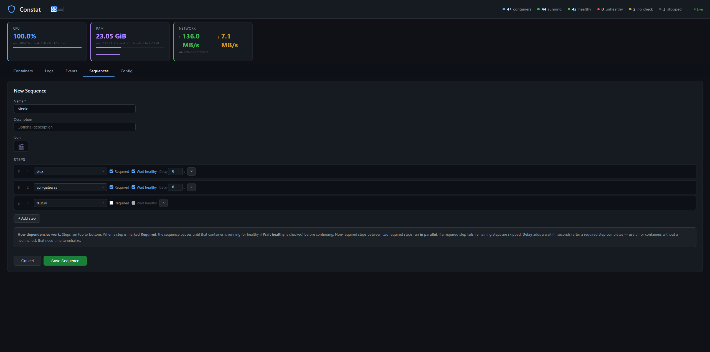
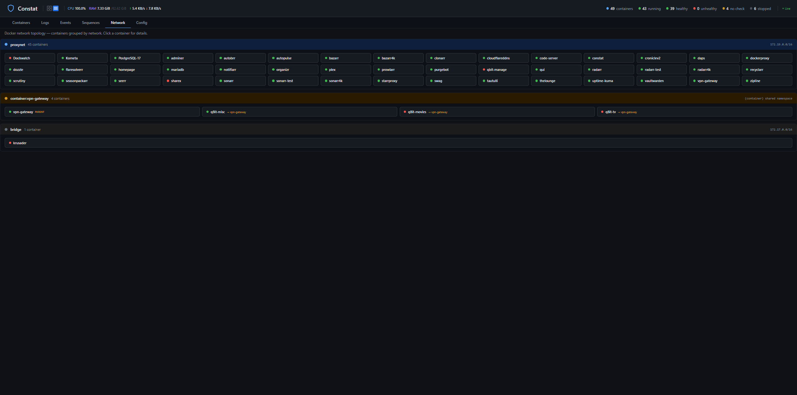

# Constat


A Docker container monitor with a built-in web UI. Track container health, view live resource stats, stream logs, get Discord notifications, and auto-restart unhealthy containers — all from a single lightweight image.

## Screenshots

| Containers | Expanded View |
|-----------|---------------|
|  |  |

| Events | Sequences |
|--------|-----------|
|  |  |

| Network Topology |
|------------------|
|  |

## Features

- **Live stats** — CPU, RAM, and network usage updated every 3 seconds via streaming
- **Health monitoring** — tracks Docker healthcheck status, detects unhealthy containers
- **Auto-restart** — label-gated restart for unhealthy containers with cooldown protection
- **Memory watch** — per-container memory thresholds with notify or restart actions
- **Image update checks** — registry digest comparison with support for private registries (GHCR sponsor packages, private org images, Docker Hub paid plans)
- **Image & volume cleanup** — scheduled or manual pruning of unused images and volumes
- **Log viewer** — real-time log streaming with level detection and color-coded display
- **Event history** — Docker events (start, stop, die, health changes) with grouping
- **Sequences** — multi-step container orchestration (start/stop chains with dependencies)
- **Charts** — CPU/RAM history graphs with 1h/6h/24h/3d/7d range selection
- **Mobile view** — dedicated mobile UI with container cards, sort/filter, charts, and events
- **Healthcheck suggestions** — built-in database of recommended healthchecks for common images
- **Config inspector** — view ports, volumes, networks, env vars, and labels per container
- **Discord notifications** — state changes, health events, new updates with colored embeds
- **Authentication** — Forms / Basic / None modes with configurable "disabled for trusted networks" bypass, session persistence across restarts, CSRF protection, and a single API key for scripts and Homepage widgets
- **Docker-native** — PUID/PGID/UMASK, healthcheck, Alpine-based (~46 MB)

## Quick Start

### 1. Run with Docker

```bash
docker run -d \
  --name constat \
  --restart unless-stopped \
  -p 7890:7890 \
  -v /var/run/docker.sock:/var/run/docker.sock:rw \
  -v /path/to/config:/config \
  -e TZ=America/New_York \
  ghcr.io/prophetse7en/constat:latest
```

On first start, a default `constat.conf` is created in the config directory. Open the Web UI at `http://your-host:7890`.

**Requirements:** Docker socket access (read/write) for container monitoring, stats, and restart. If you prefer not to mount the socket directly, see [Docker Socket Proxy](#docker-socket-proxy) below.

### 2. Initial Setup

1. Open `http://your-host:7890` — on first run you'll be redirected to `/setup` to create an admin account (see [Authentication](#authentication))
2. After login, your containers appear automatically with live stats (CPU, RAM, network)
3. Click any container row to expand details, charts, and quick actions
4. To enable auto-restart, add the Docker label `constat.restart=true` to containers you want restarted when unhealthy (see [Auto-Restart](#auto-restart))
5. To set up Discord notifications, go to the **Config** tab and add your webhook URLs (see [Discord Webhooks](#discord-webhooks))
6. To add memory monitoring, create rules in the **Config** tab under Memory Watch (see [Memory Monitoring](#memory-monitoring))

## Web UI

The built-in Web UI runs on port 7890 (same container, no separate service).

### Containers Tab

The main view — a sortable table of all containers with live-updating stats:

- **Filter pills** — All, Running, Healthy, Unhealthy, No Check, Stopped
- **Search** — filter by container name
- **Sortable columns** — Name, Health, Restart, CPU, RAM, Network, Uptime
- **Sparklines** — mini CPU/RAM/Network graphs in each row (click to open full chart)
- **Restart toggle** — clickable Yes/No to override auto-restart per container

**Expanded view** (click a container row):
- Container details: image, state, started/created dates, healthcheck command
- Config inspector: ports, volumes, networks, environment variables, labels
- CPU/RAM charts with selectable range (1h, 6h, 24h, 3d, 7d) and multi-container comparison
- Memory watch rules with live progress bars
- Healthcheck suggestions for containers without a healthcheck
- Quick actions: Start, Stop, Restart

### Mobile View

A dedicated mobile-optimized UI — auto-detected on small screens, with a manual toggle in the header:

- **Container cards** — compact cards showing name, status, health, CPU, RAM, and uptime
- **Tap to expand** — memory watch rules with progress bars, CPU/RAM charts, and action buttons
- **Sort and filter** — filter by status (all/running/stopped) and sort by name, CPU, RAM, or health
- **Resource summary** — total CPU, RAM, and network I/O at a glance
- **Events tab** — simplified event timeline with grouped events
- **Persistent preference** — your view choice is saved in localStorage

### Logs Tab

Real-time log streaming for any container:

- Sidebar with container list for quick switching
- Server-side timestamp extraction and ANSI escape stripping
- Color-coded level detection (error, warn, info, debug)
- Dozzle-inspired styling with colored left borders per level
- Tail line count selector (100, 500, 1000)

### Events Tab

Docker event history with intelligent grouping:

- State events: started, stopped, died, restarted, paused
- Health events: unhealthy, healthy, recovered
- Memory events: threshold notify, restart, blocked, recovered
- Auto-restart indicators and grouped rapid events
- Newest-first ordering with load-more pagination

### Sequences Tab

Multi-step container orchestration:

- Create named sequences with emoji icons
- Add steps: start, stop, or restart specific containers
- Per-step options: required/optional, wait for healthy, custom delay
- Live execution tracking with step-by-step progress
- Dependency chains — fail-fast on required steps, skip optional failures
- Searchable container dropdown for step assignment

### Tools Tab

Operational tools that complement the pure settings in Config:

- **Memory Watch** — per-container memory thresholds with live progress bars, inline editor, and grouped rule display
- **Image Updates** — registry digest comparison (no pulls), scheduled checks with Discord notifications for new updates, color-coded status per container in the main table
- **Private registry login** — optional credential store for sponsor-gated GHCR packages, private organization images, and paid Docker Hub accounts. Credentials are verified against the registry's `/v2/` endpoint before saving and stored in `/config/.docker/config.json` with 600 permissions. Public images always work without any login — the registry login only unlocks update checks for images that anonymous requests cannot reach.
- **Cleanup** — manual or scheduled pruning of unused Docker images and volumes, with dry-run mode for safety

### Config Tab

Edit all settings from the browser:

- Discord webhooks (state + health + maintenance, separate channels)
- Gotify notifications
- Display toggles: show/hide stats columns, charts
- Embed color customization with hex previews
- Time/date format and timezone
- Webhook test button

## Configuration

All settings live in `/config/constat.conf` (bash format). A sample config is created on first start with all options documented. You can edit the file directly or use the Config tab in the Web UI.

### Discord Webhooks

Send notifications to Discord when containers change state or become unhealthy.

1. In Discord, right-click a channel > **Edit Channel** > **Integrations** > **Webhooks** > **New Webhook**
2. Copy the webhook URL
3. Add it in the Config tab or directly in `constat.conf`:

```bash
ENABLE_DISCORD="true"
DISCORD_WEBHOOK_STATE="https://discord.com/api/webhooks/..."   # start/stop/die/restart
DISCORD_WEBHOOK_HEALTH="https://discord.com/api/webhooks/..."  # unhealthy/recovered
```

You can use the same webhook URL for both, or separate channels for different notification types. Use the **Test Webhook** button in the Config tab to verify.

### Auto-Restart

Constat only restarts containers that have the Docker label `constat.restart=true`. This prevents accidental restarts of containers you want to manage manually.

**Adding the label:**
- **Docker run:** `--label=constat.restart=true`
- **Docker Compose:** under `labels:` add `constat.restart: "true"`
- **Unraid:** add `--label=constat.restart=true` in Extra Parameters

Containers without the label are still monitored — health events go to Discord, but no restart is attempted.

```bash
RESTART_LABEL="constat.restart"
RESTART_COOLDOWN="300"    # Min seconds between restarts
MAX_RESTARTS="3"          # Max attempts per cooldown window
```

The restart override toggle in the UI lets you temporarily disable auto-restart per container without removing the label.

### Memory Monitoring

Watch memory usage per container — no Docker `--memory` flags needed. When a container stays above the threshold for the specified duration, Constat can notify you or restart it.

```bash
MEMORY_PAUSED="false"
MEMORY_POLL_INTERVAL="30"
MEMORY_DEFAULT_DURATION="300"   # Seconds above threshold before action

MEMORY_WATCH=(
    "plex:4g:restart"             # Restart if >4 GiB for 5 min
    "radarr:2g:notify"            # Notify if >2 GiB for 5 min
    "qBit-movies:3g:restart:600"  # Restart if >3 GiB for 10 min
)
```

Rules can also be managed from the Config tab in the Web UI.

### Image Update Checks

Constat can check whether newer versions of your container images exist on the registry, without pulling anything. It asks the Docker daemon for the current remote manifest digest and compares it to what is stored locally — if they differ, the container is flagged as "Outdated" in the main table.

**Enable it** in the Tools tab under Image Updates. You can pick how often the scheduled check runs (6/12/24 hours) and list containers to exclude. Each full check takes about 60–120 seconds depending on how many containers you have. A one-shot **Check Now** button triggers a manual run with a live progress counter.

**Private registries.** Public images work without any configuration — Constat contacts the registry anonymously. Some images require authentication (sponsor-gated GHCR packages, private organization images, paid Docker Hub tiers). Those show up as **No access** in the Update column. To enable checks for them, expand the **Private registry login** subsection under Image Updates and add a credential:

1. For GHCR: create a [classic personal access token](https://github.com/settings/tokens/new) with **only** the `read:packages` scope. Do not enable `repo`, `write:packages`, `delete:packages`, or any other scope — `read:packages` is read-only and cannot modify anything on your account.
2. For Docker Hub: create an access token at [hub.docker.com/settings/security](https://hub.docker.com/settings/security) with **Public Repo Read-only** permission.
3. Paste the token into the login form and click Login. Credentials are verified against the registry before saving — invalid tokens are rejected immediately.

Credentials are stored in `/config/.docker/config.json` using the standard Docker config format (the same file `docker login` writes). The file is created with 600 permissions (owner-only). Tokens are never shown again after saving, never returned via the API, and never logged. Click **Remove** next to a registry to delete the stored credentials immediately.

If an authenticated request is rejected for an image that is actually publicly pullable (GHCR sometimes does this when the token owner doesn't have explicit access to a public package), Constat automatically retries anonymously so logging in to one registry never breaks checks for other packages on the same host.

### Healthcheck Suggestions

Constat includes a built-in database of recommended healthcheck commands for common Docker images (Plex, Radarr, Sonarr, Prowlarr, Bazarr, PostgreSQL, MariaDB, qBittorrent, SWAG, and more). When a running container has no healthcheck configured, a suggestion appears in the expanded view with the command to add as an Extra Parameter. Ports are automatically detected from the container's actual port bindings — if a non-standard port is in use, the suggestion adjusts automatically.

### Docker Socket Proxy

If you prefer not to mount the Docker socket directly, Constat supports connecting via a TCP proxy:

```bash
-e DOCKER_HOST=tcp://dockerproxy:2375
```

Note: you'll need read/write access for container restart and start/stop functionality. Read-only proxies will limit Constat to monitoring only.

## Docker

### Environment Variables

| Variable | Required | Default | Description |
|----------|----------|---------|-------------|
| `TZ` | No | `UTC` | Container timezone |
| `PUID` | No | `99` | User ID for file ownership |
| `PGID` | No | `100` | Group ID for file ownership |
| `UMASK` | No | `002` | File creation mask |
| `DOCKER_HOST` | No | — | Docker socket proxy URL (optional) |
| `UI_ENABLED` | No | `true` | Set to `false` to disable the web UI |
| `TRUSTED_NETWORKS` | No | *(empty — uses Radarr-parity defaults)* | Lock **Trusted Networks** at host level. Comma-separated IPs/CIDRs (`192.168.86.0/24, 10.66.0.0/24`). When set, the UI field is disabled and cannot be changed via the web interface — only by editing the template and restarting. Useful for defense-in-depth against UI-takeover attackers expanding the trust boundary. |
| `TRUSTED_PROXIES` | No | *(empty)* | Lock **Trusted Proxies** at host level. Comma-separated IPs. Same UI-disabled behavior as `TRUSTED_NETWORKS`. Only needed when Constat sits behind a reverse proxy that terminates TLS (SWAG, Authelia, Traefik). |

### Volumes

| Container Path | Purpose |
|---------------|---------|
| `/var/run/docker.sock` | Docker socket (required for monitoring) |
| `/config` | Config, sequences, stats history, restart overrides, registry logins (`.docker/config.json`) |

### Ports

| Port | Purpose |
|------|---------|
| `7890` | Web UI |

### Docker Compose

```yaml
services:
  constat:
    image: ghcr.io/prophetse7en/constat:latest
    container_name: constat
    restart: unless-stopped
    ports:
      - "7890:7890"
    volumes:
      - /var/run/docker.sock:/var/run/docker.sock:rw
      - ./constat-config:/config
    environment:
      - TZ=America/New_York
      - PUID=99
      - PGID=100
```

### Building from Source

```bash
git clone https://github.com/prophetse7en/constat.git
cd constat
docker build -t constat:latest .
```

### Healthcheck

Built-in healthcheck calls `/api/summary` every 60 seconds. Docker (and platforms like Unraid/Portainer) will show the container as healthy when the API responds.

### Unraid

**Install via Community Apps:** Search for **constat** in the Apps tab — click Install and configure your settings.

**Or install manually:** Go to **Docker** → **Add Container**, set Repository to `ghcr.io/prophetse7en/constat:latest`, and add the required paths and ports (see above).

The Web UI is available at `http://your-unraid-ip:7890`. Config and stats are stored in `/mnt/user/appdata/constat` by default.

**Updating:** Click the Constat icon in the Docker tab and select **Force Update** to pull the latest image.

## Architecture

Constat runs two processes in a single container:

- **constat.sh** — Bash script that watches Docker events, batches notifications, sends Discord webhooks, handles memory monitoring, and manages auto-restart logic
- **constat-ui** — Go binary serving the web UI and REST API, streaming live stats via SSE

```
Docker Engine
  ├── constat.sh (bash) — event watcher + Discord + memory + auto-restart
  └── constat-ui (Go)   — web UI + REST API + SSE streaming
       ├── /api/containers         — container list with stats
       ├── /api/stats/stream       — SSE: live stats every 3s
       ├── /api/containers/{id}/logs/stream — SSE: live log streaming
       ├── /api/events/stream      — SSE: Docker events
       ├── /api/sequences/*        — sequence CRUD + execution
       ├── /api/updates            — image update check results
       ├── /api/registry           — private registry logins (list/add/remove)
       ├── /api/images, /api/volumes — image and volume cleanup
       ├── /api/config             — config read/write
       ├── /api/health-suggestions — healthcheck database
       └── /api/summary            — container counts (healthcheck endpoint)
```

**Stats pipeline:**
- N goroutines stream `docker stats` per container
- Stats batched every 3s → SSE to frontend (patches in-place)
- History appended every 30s (ring buffer, up to 7d)
- Persisted to disk every 5 minutes

**Frontend:** Alpine.js single-page app with Tailwind-inspired styling. No build step — single `index.html` embedded in the Go binary.

## Authentication

As of **v0.9.17**, the Web UI requires authentication. The model follows Radarr/Sonarr's convention — familiar if you're coming from that ecosystem.

### First-run setup

On first access after install or upgrade, you'll be redirected to `/setup`:

1. Create an admin **username** (1–64 chars, no control chars)
2. Create a **password** (minimum 10 characters, at least 2 of: uppercase, lowercase, digit, symbol)
3. Confirm the password and submit

You're automatically logged in and land in the app. Existing config is preserved — only credentials are new.

### Two settings you control

**Settings → Security:**

| Setting | Choices | What it does |
|---|---|---|
| **Authentication** | `Forms` (default) / `Basic` / `None` | *How* the user authenticates. Forms shows a login page; Basic uses the browser's built-in popup (best behind a reverse proxy); None disables auth entirely (requires typed confirmation and shows a persistent warning banner) |
| **Authentication Required** | `Disabled for Trusted Networks` (default) / `Enabled` | *When* login is required. Default lets LAN devices skip login; Enabled requires login from every IP including localhost |

### Trusted Networks

When `Authentication Required = Disabled for Trusted Networks`, devices on the listed networks skip the login page. Two modes:

- **Leave empty** (default) — matches Radarr: trusts all private network ranges (`10.x`, `172.16–31.x` incl. Docker bridges, `192.168.x`, link-local, IPv6 ULA) plus loopback. Convenient but trusts anything with a private IP, including every Docker container on the host.
- **Set a custom list** — trusts only specific IPs or CIDR subnets you enter. Example: `192.168.86.0/24, 10.66.0.0/24` trusts your home VLAN + your WireGuard tunnel, nothing else. Devices on Docker bridges (172.17.x, 172.19.x) then need to log in or use the API key.

Loopback (`127.0.0.1`) is always trusted regardless, so Docker healthchecks and localhost admin tools don't need to authenticate.

### API key

For scripts, Homepage widgets, and other programmatic integrations, use the API key from **Settings → Security**:

```bash
curl -H "X-Api-Key: <key>" http://your-host:7890/api/summary
```

The key is also accepted as a `?apikey=<key>` query parameter, but the header form is preferred (query parameters leak to access logs and browser history).

Click **Regenerate API Key** to rotate. The old key stops working immediately — update any scripts or widgets that use it.

### Reverse-proxy deployments (SWAG, Traefik, Authelia)

If Constat runs behind a reverse proxy:

1. Set `AUTHENTICATION` to `basic` or `forms` depending on what your proxy handles
2. Set `TRUSTED_PROXIES` in `/config/constat.conf` to the proxy's IP (e.g. `TRUSTED_PROXIES="172.17.0.1"`) so Constat reads the real client IP from `X-Forwarded-For` and respects `X-Forwarded-Proto` for Secure-cookie flag
3. If the proxy handles auth (Authelia, Cloudflare Access) and you don't want Constat to prompt as well, set `AUTHENTICATION=none`

### Protection layers in place

- **CSRF** (double-submit cookie) blocks cross-site request forgery on all write endpoints
- **SSRF** (outbound HTTP validation) blocks Constat from being used to probe your internal network via the webhook-test / Gotify-test / registry-login endpoints
- **Sensitive data redaction** — environment variables with names like `*_KEY`, `*_TOKEN`, `*_PASSWORD`, `*_SECRET` etc. are replaced with `[REDACTED]` in the container-config endpoint, so Constat can't be used to leak credentials from *other* containers on the host
- **Session persistence** — once logged in, your session survives container restarts within its TTL (30 days default)
- **Security headers** — `X-Frame-Options: DENY`, `X-Content-Type-Options: nosniff`, `Referrer-Policy: same-origin` on every response

### External exposure

Constat deliberately does **not** include rate limiting or a dedicated audit log. If you expose the port beyond your LAN:

- Use a reverse proxy (SWAG, Traefik) with `fail2ban` or `CrowdSec` in front for brute-force protection
- Set `Authentication Required = Enabled` so even LAN requires login
- Consider Authelia or Cloudflare Access for 2FA/SSO

## Security Notes

- Docker socket access grants full container control — use a socket proxy for read-only if you don't need restart/start/stop
- Registry credentials (if you use Private registry login) are stored at `/config/.docker/config.json` in the standard Docker format with 600 permissions — the same as `docker login` on the host. Back up or restrict your `/config` mount accordingly
- Admin credentials live in `/config/auth.json` (mode 600) — bcrypt-hashed passwords, never plaintext. Do not commit this file or ship it in images
- If you forget your password and can't log in, delete `/config/auth.json` and restart the container — it will show the setup wizard again. **Existing configuration is preserved** (only the credentials file is touched)

## Support

For questions, help, or bug reports:

- **Discord:** [`#prophetse7en-apps`](https://discordapp.com/channels/492590071455940612/1486391669384417300) on the [TRaSH Guides Discord](https://trash-guides.info/discord) (under Community Apps)
- **GitHub:** [ProphetSe7en/constat/issues](https://github.com/ProphetSe7en/constat/issues)

## License

MIT
